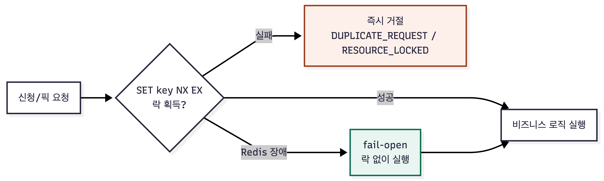

# redis-distributed-lock


실무에서 담당했던 매칭 서비스의 신청·픽 동시성 제어 경험을 재구성한 레포지토리입니다.  
도메인 용어는 일부 일반화했고, 락 구조와 판단 과정은 실제와 동일합니다.

```bash
docker compose up --build
```

---

## 해결한 두 가지 동시성 문제

| 문제 | 상황 | 락 기준 | 실패 응답 |
|------|------|---------|-----------|
| 따닥 방지 | 멘티가 신청서 저장 버튼을 연속 클릭 | `memberNo` | `DUPLICATE_REQUEST` |
| 선착순 동시성 제어 | 여러 멘토가 같은 신청서를 동시에 픽 | `consultationId` | `RESOURCE_LOCKED` |

락을 하나로 합치지 않고 둘로 나눈 이유가 있습니다.  
유저 기준 락만 있으면 서로 다른 멘토가 같은 신청서를 동시에 픽하는 걸 못 막고,  
리소스 기준 락만 있으면 한 유저가 서로 다른 신청서를 연달아 저장하는 정상 요청까지 막힙니다.  
보호하려는 대상이 다르면 락 키도 달라야 했습니다.

## Redis SET NX 를 선택한 이유

요구사항이 단순했기 때문에 `SET NX EX` 한 줄이면 충분하다고 판단했습니다.

검토했던 것들:

- **DB 유니크 제약** : 중복 "요청" 자체를 걸러주지는 못합니다. 매번 insert 시도 후 예외로 알게 되는 구조라 비용이 큼.
- **DB 비관적 락** : 커넥션을 물고 대기하는 시간이 늘어나고, 인스턴스가 여러 대라 락 경합이 DB로 몰립니다.
- **Redisson** : 이 프로젝트의 요구사항은 "락 획득 실패 시 즉시 거절"하는 짧은 임계 구간 제어였습니다.
  별도 대기 큐나 자동 TTL 연장이 필요하지 않았고, 동작 방식을 명확히 드러내기 위해 `SET NX EX`와 Lua Script만으로 직접 구현했습니다.


```
SET LEEWORMS:USER_REQUEST_LOCK:CONSULTATION_FORM_SAVE:123  <UUID>  NX  EX 3
SET LEEWORMS:RESOURCE_LOCK:MATCHING_PICK:1000              <UUID>  NX  EX 10
```

value에 UUID를 저장해 **락 소유권을 검증**합니다.  
TTL이 만료된 후 다른 요청이 같은 키의 락을 재획득한 경우, 이전 요청의 해제 시도가 그 락을 삭제하지 않도록 Lua Script로 원자적으로 확인 후 삭제합니다.

| 옵션 | 역할 |
|------|------|
| `NX` | 키가 없을 때만 저장 → 락 획득을 원자적으로 처리 |
| `EX` | TTL 설정 → 프로세스 장애가 나도 락이 영구히 남지 않음 |


## 사용 방법

컨트롤러에서 `LockManager`를 직접 호출합니다.

```java
// 유저 락 — 같은 memberNo로 들어오는 중복 요청 차단
lockManager.executeWithLock(LockPurpose.CONSULTATION_FORM_SAVE, memberNo, () -> {
    simulateWork(500);
    return "copied";
});

// 리소스 락 — 같은 consultationId에 대한 선착순 경쟁 제어
lockManager.executeWithResourceLock(LockPurpose.MATCHING_PICK, consultationId, () -> {
    simulateWork(300);
    return "picked";
});
```


## 락 획득 플로우



`LockManager` 내부에서 키를 만들고, Redis에 락을 시도하고, 작업을 실행합니다.

대기나 재시도는 없습니다.
- 락을 획득하면 실행
- 못 하면 바로 거절
- Redis가 죽어 있으면 락 없이 실행.

3가지가 전부입니다.

```java
// 1. 키 생성
String lockKey = lockKeyBuilder.userLockKey(lockPurpose, memberNo);
// → "LEEWORMS:USER_REQUEST_LOCK:CONSULTATION_FORM_SAVE:123"

// 2. 락 획득 시도 — UUID를 value로 저장해 소유권 추적
String token = tryLock(lockKey, lockPurpose);
// → SET LEEWORMS:USER_REQUEST_LOCK:CONSULTATION_FORM_SAVE:123 <UUID> NX EX 3

// 3. 락 획득 실패 시 즉시 예외
if (token == null) {
    throw new DuplicateRequestException(...);
}

// 4. 작업 실행 후 락 해제 (소유권 확인 후 삭제)
try {
    return task.get();
} finally {
    unlock(lockKey, token); // Lua Script: value가 내 UUID일 때만 DEL
}
```

## Fail-Open 판단

신청서 개수나 상태가 일부 어긋나는 문제는 운영에서 확인 후 보정할 수 있지만,  
Redis 장애 때문에 신청 자체가 막히는 쪽이 더 큰 문제라고 판단했습니다.

Redis 장애 시 요청을 막지 않고 비즈니스 로직을 그냥 실행합니다.

```java
// Redis 장애 시 "FAIL_OPEN" 고정 토큰 반환 → 비즈니스 로직 진행
// release() 시 Lua Script가 실제 UUID와 다른 값을 비교해 DEL을 건너뜀
private String tryLock(String key, LockPurpose purpose) {
    try {
        return redisLockClient.tryAcquire(key, purpose.getTtl());
    } catch (Exception e) {
        log.error("Redis 락 획득 중 오류 발생 (Fail-Open 적용) - key: {}", key, e);
        return "FAIL_OPEN";
    }
}
```

## 다루지 않은 것들

- **fail-open 모니터링** : 락 없이 우회된 요청이 얼마나 되는지 에러 로그로만 남겼습니다. 실 운영에서는 Fail-Open 발생 횟수를 메트릭으로 추적해 Redis 장애 알림과 연결해야 합니다.
- **워치독(watchdog)** : TTL보다 작업이 오래 걸리면 락이 만료되어 중복 실행 가능성이 생깁니다. 현재는 TTL을 작업 예상 시간의 3배로 잡아 여유를 두었고, Redisson의 워치독처럼 TTL을 주기적으로 연장하는 기능은 구현하지 않았습니다.


## 프로젝트 실행 & 테스트

```bash
docker compose up --build
```

```bash
# 유저 락 — 같은 memberNo로 빠르게 두 번 요청 → 두 번째는 DUPLICATE_REQUEST
curl -X POST "localhost:8080/api/demo/form/consultation/copy?memberNo=123&formId=1000" &
curl -X POST "localhost:8080/api/demo/form/consultation/copy?memberNo=123&formId=1000"

# 리소스 락 — 같은 consultationId에 서로 다른 멘토가 동시 픽 → 한 명만 성공
curl -X POST "localhost:8080/api/demo/form/consultation/pick/1000?mentorNo=501" &
curl -X POST "localhost:8080/api/demo/form/consultation/pick/1000?mentorNo=502"

```